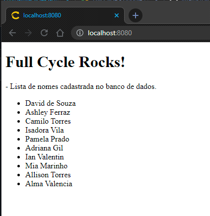

# Nginx com Node.js®

## Enunciado

Nesse desafio você colocará em prática o que aprendemos em relação a utilização do nginx como proxy reverso. A idéia principal é que quando um usuário acesse o nginx, o mesmo fará uma chamada em nossa aplicação `Node.js®`. Essa aplicação por sua vez adicionará um registro em nosso banco de dados `MySQL™`, cadastrando um nome na tabela people.

O retorno da aplicação node.js para o nginx deverá ser:

```html
<h1>Full Cycle Rocks!</h1>

- Lista de nomes cadastrada no banco de dados.
```

Gere o docker-compose de uma forma que basta apenas rodarmos: `docker-compose up -d` que tudo deverá estar funcionando e disponível na porta: `8080`.

Suba tudo em um repositório e faça a entrega.

## Resposta

[docker-compose.yml](./docker-compose.yml)


