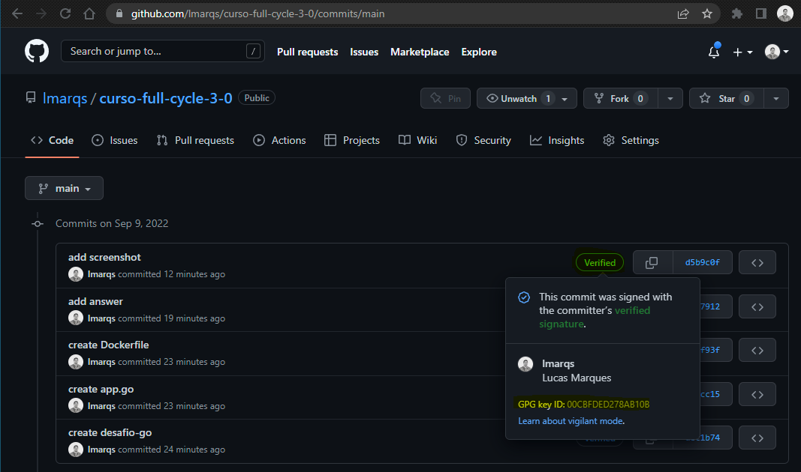

# Assine seu Commit

## Enunciado

Um dos principais pontos para aumentar segurança e a garantia de que um commit foi realmente realizado por determinado desenvolvedor é a assinatura de commits utilizando GPG.

Nesse desafio, crie um repositório GIT no Github e faça um push de um commit assinado por você.

## Resposta

[Repositório com histórico de commits assinados](https://github.com/lmarqs/curso-full-cycle-3-0/commits/main)

